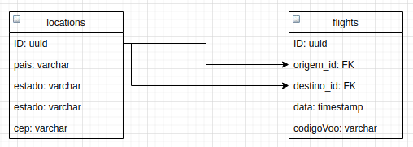

## Instalação e configuração

1. Faça um clone desse repositório;
2. Acesse a raiz do projeto `cd back`;
3. Faça uma cópia do env `cp .env.example .env` e configure a URL da API;
4. De preferencia use o `yarn`, instale seguindo [link](https://yarnpkg.com/getting-started/install);
5. Rode `yarn` para instalar as depenências;
6. Rode `yarn dev:server` para iniciar o servidor.

## Gerar ambiente de produção execute.

```
    yarn build
```

## Estrutura de pastas

```
└── dist
└── src
    ├── shared/ # funções e configurações complartilhadas por toda a aplicação
    ├── modules/ # pastas responsaveis por suas funcionalidades únicas
      └── dtos # interfaces descrevendo dados para criar/atualizar alguma instância
      └── infra # pastas de http(rotas e controller), referente ao modulo
      └── http # pastas de http(rotas e controller), referente ao modulo
            └── controller # controller responsável pelo modulo
            └── routes # rotas de acesso as funções do controller do modulo
          └── typeorm # pastas referentes a entidade relacionado ao modulo, e o repositório referente a entidade
            └── entities # entidade referente a tabela do banco
            └── repositories # repositorio para executar queries do banco
      └── repositories # interface definindo os métodos usados no repositorio do módulo
      └── services # ações especializadas para executar uma única função, criar/atualizar/deletar
└── __tests__/ # para testes de comportamento e interface
```

## Diagrama ER(Entindade Relacionamento)



Um voo(Flight) pertence a uma Origem/Destino(location)

## Executar migrations

`yarn typeorm migration:run`

## Tecnologias

- Node
- Express
- TypeScript
- Date Fns
- TypeOrm
- CORS
- Axios
- Randomstring
- Tsyringe
- ESlint
- Prettier
